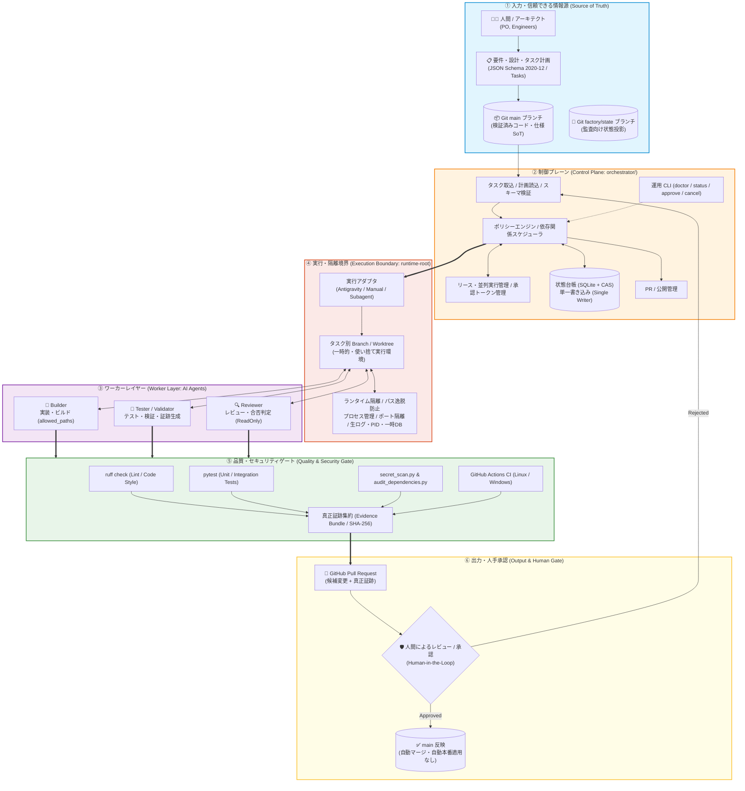
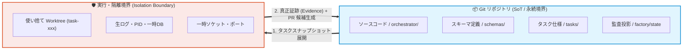
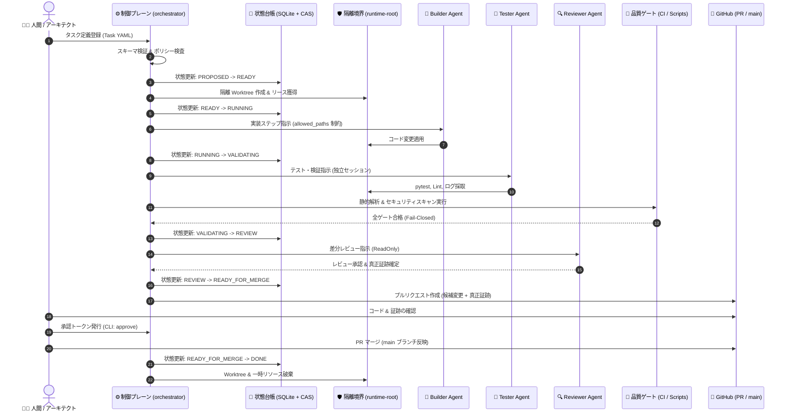

# Architecture Specification (v1.0)

> **要件定義からプルリクエスト作成・人手承認までを安全にオーケストレーションするアーキテクチャ仕様書**

---

## 1. システムアーキテクチャ全体像

AI Engineering Factory は、自律型 AI エージェントのエンジニアリング作業を、決定論的かつ安全に管理するためのオーケストレーション基盤です。

### 全体データフロー & コンポーネント関連図

---

## 2. 設計の基本原則 (Core Principles)

| 原則 | 目的・動機 | 実装機構 |
| :--- | :--- | :--- |
| **単一の状態書き込み** *(Single Writer)* | 複数エージェントや分散プロセスによる競合・デッドロック・状態不整合の完全排除。 | 状態遷移は `orchestrator.engine` 内の SQLite トランザクションと CAS (Compare-And-Swap) リビジョン番号で直列化。分散 Git ロックは禁止。 |
| **重要操作は承認必須** *(Human-in-the-Loop)* | AI エージェントのハルシネーションや不正コードによる本番破壊・予期せぬ外部公開を防止。 | • `main` ブランチ直接 push 禁止（保護ルール必須）。 • 自動マージ・自動本番デプロイの全面禁止。 • 承認トークン（CLI: `orchestrator.cli approve`）と人間レビュー必須。 |
| **永続記憶はリポジトリ中心** *(Git-backed SoT)* | すべての成果物・仕様・検証結果の再現性・監査性を長期的に担保。 | • `main` ブランチがコードおよび仕様（スキーマ・タスク定義）の真実の源泉 (SoT)。 • `factory/state` ブランチに監査用イベント履歴を投影。 |
| **SoT と使い捨てランタイムの完全分離** *(Isolation Boundary)* | エージェントによるリポジトリ汚染、未管理ファイルの残留、シークレット漏洩の防止。 | 作業はすべて Git 外の `runtime-root` 配下の使い捨て Worktree で実行。生ログ、PID、一時DB、ソケットはリポジトリ外に閉じ込める。 |
| **安全側への倒しこみ** *(Fail-Closed Validation)* | 境界外アクセスや未登録コマンド、未知スキーマのすり抜けを一切許容しない。 | 不明なスキーマフィールドの拒否、`shell=True` の排除、未定義コマンドの拒絶、CI 1項目失敗での即時停止。 |

---

## 3. 隔離境界: Git リポジトリ vs `runtime-root`

エージェントがアクセス可能な領域と、長期的な信頼境界は明確に物理分離されています。

| 領域 | 格納対象 | 保持期間 | アクセス権限 | 監査性 |
| :--- | :--- | :--- | :--- | :--- |
| **Git リポジトリ (SoT)** `main` / `factory/state` | • 仕様・スキーマ (`schemas/`) • 制御プレーン実装 (`orchestrator/`) • タスク定義 (`tasks/`) • 状態投影 (`state/`) • ドキュメント (`docs/`) | 永続 (Git 履歴) | 制御プレーンのみコミット可能 エージェントは直接変更不可 | 高 (Git コミット履歴・署名) |
| **実行・隔離境界** `runtime-root` (Git 外) | • タスク別 Worktree • 一時ソケット・ポート • プロセス PID ファイル • 未加工の実行生ログ • 一時 SQLite DB | 一時的 (タスク完了後に破棄) | Builder/Tester が隔離実行 `allowed_paths` スコープ内のみ | 中 (証跡バンドルに要約後、破棄) |

---

## 4. エンドツーエンド処理シーケンス

---

## 5. 品質・セキュリティゲート仕様

すべての変更は、以下のゲートをすべて **100% 合格 (Fail-Closed)** しなければ PR 作成およびマージに進むことはできません。

| ゲート種別 | 実行ツール / コマンド | 検証基準 (Pass Criteria) | 失敗時の振る舞い |
| :--- | :--- | :--- | :--- |
| **Lint / スタイル** | `ruff check .` | 警告・エラーが 0 件であること | 即時 FAILED 遷移 |
| **単体・結合テスト** | `pytest -q` | 全テストケースが PASS すること | 即時 FAILED 遷移 |
| **シークレット漏洩** | `python scripts/secret_scan.py` | API キー、トークン、秘密鍵の混入が 0 件 | 即時 FAILED 遷移・ログ秘匿 |
| **依存関係監査** | `python scripts/audit_dependencies.py` | 未承認パッケージ・既知の脆弱性・ライセンス違反なし | 即時 FAILED 遷移 |
| **CI パイプライン** | GitHub Actions (Linux & Windows) | マトリクス実行で全テストと解析が PASS | PR マージブロック |
| **証跡完全性** | Evidence Bundle Generator | SHA-256 ダイジェストとログ真正性が一致 | 承認トークン無効化 |

