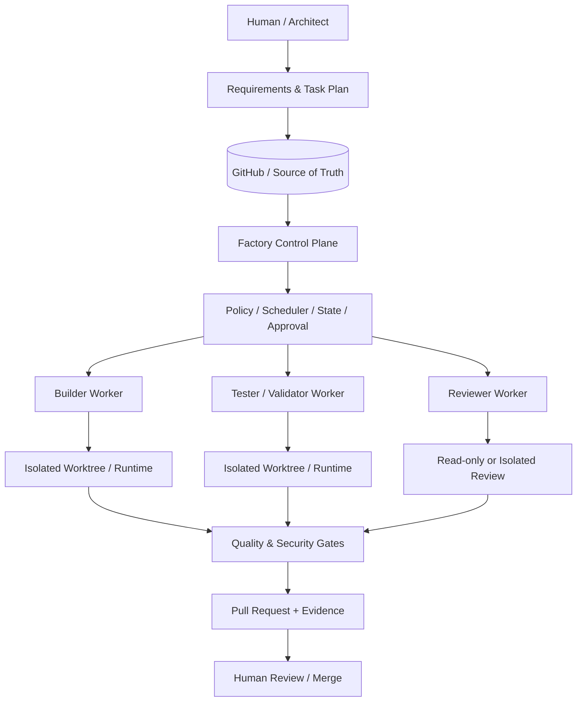

# AI Engineering Factory

[](https://github.com/moruku36/ai-engineering-factory/actions/workflows/ci.yml)

> エンジニアリング計画を、分離されたAIエージェントのタスク、検証済みの変更、レビュー証跡、そして人間が承認するPull Requestへつなげるための、安全性を重視したリポジトリ中心の開発基盤です。

**現在のステータス: Experimental / Integration Verified**  
Control Plane、実行分離、Human Approval、検証、Antigravity Adapter、GitHub連携まで実装・テストしています。ただし、現時点では本番利用を前提とした完全自律開発プラットフォームではなく、AIエージェントを使ったソフトウェア開発を安全に工程化するための実験的な基盤です。現在の状態と制約は [PROJECT_STATE.md](PROJECT_STATE.md) を参照してください。

## これは何？

AIコーディングツールはコード生成そのものは得意ですが、作業が長期化し、複数のAgent、Session、Branch、Test、Review、Approvalが関わるようになると、単純なコード生成だけでは管理が難しくなります。

特に問題になるのは、次のような点です。

- Agent同士が同じファイルや作業環境を壊してしまう
- どこまで作業が終わったのか分からなくなる
- Sessionが切り替わると前のAgentの判断や進捗が失われる
- Agentが「完了した」と言っていても、本当にテストやレビューが通っているとは限らない
- 複数Agentを増やした結果、かえってコストや調整作業が増える
- Cloud、IAM、Credential、Deployなどの危険な操作まで自動化してしまう

AI Engineering Factory は、こうした問題を解決するために、AIエージェント開発の周囲に**軽量なOrchestration / Governanceレイヤー**を追加します。

```text
要件定義 / アーキテクチャ設計
        ↓
Machine-readableなTaskへ分割
        ↓
Branch + Worktree + Runtime Namespaceで分離
        ↓
実装 / テスト / 独立レビュー
        ↓
Security & Quality Gate
        ↓
Pull Request + Evidence
        ↓
Human Review / Merge
```

このFactoryでは、GitHub Repositoryを長期的な **Source of Truth** として扱います。

Task Manifest、Architecture Decision、Rule、Skill、進捗、Handoff、Validation Evidence、Git historyなどをRepositoryまたは永続Stateに残すことで、特定のAIモデルのMemoryや1回のSessionに依存しない開発を目指します。

これは新しいFoundation Modelでも、巨大なAgent Frameworkでもありません。Google AntigravityなどのAIコーディング環境や他のAgent Runtimeの外側に置き、**設計 → タスク分割 → 実装 → 検証 → レビュー → PR** を安全かつ再現可能に回すための基盤です。

## なぜ作ったのか

このプロジェクトでは、Agentic Engineeringで繰り返し発生する5つの課題を中心に設計しています。

- **安全な並列化**  
  独立したTaskだけを並列実行し、依存関係が強い作業は無理に並列化しません。

- **実行環境の分離**  
  TaskごとにBranch / Worktree / Runtime Namespaceを分け、ファイルだけでなくPort、Process、Temporary Data、Stateなどの衝突も防ぎます。

- **永続的なMemory / Handoff**  
  Rule、Task State、ADR、Progress、HandoffをGitや永続Stateに保存し、1つのモデルやSessionの内部Memoryに依存しません。

- **検証可能な完了条件**  
  Agentが「Done」と回答するだけでは完了としません。Test、Validation、Review Evidence、Policy Checkなど、Machine-readableな証跡を要求します。

- **Human Control**  
  Destructive Operation、Infrastructure Apply、Credential、IAM、Deployment、Release、Mergeなどの重要操作にはHuman Approvalを残します。

設計上の優先順位は次の通りです。

**Safety → Reproducibility → Observability → Maintainability → Cost Efficiency → Parallel Throughput → Automation**

自動化そのものを目的にせず、安全性と再現性を優先します。

## Architecture Overview



アーキテクチャは大きく **Control Plane** と **Worker Layer** に分かれます。

Control PlaneはTask Schema、Policy、State、Scheduling、Approval、Publishingなどを担当し、Workerは割り当てられたTaskの実行だけを担当します。

AntigravityはAdapter経由で接続するため、Factory Coreが特定のAgent Runtimeだけに強く依存しない構造を目指しています。

詳細は [ARCHITECTURE.md](ARCHITECTURE.md)、[AGENTS.md](AGENTS.md)、[docs/architecture/](docs/architecture/) を参照してください。

## 現在できること

現在の実装には、主に以下が含まれています。

- SchemaベースのTask / State管理
- Dependency-aware SchedulerとTask Lifecycle管理
- Worktree、Path、Process、Runtime Resourceの分離
- 永続StateとRetry管理
- Cryptographically bound / Single-useなHuman Approval Token
- Registered Commandによる実行境界
- Native Antigravity AdapterとManual / Test Adapter
- Remote SHA確認と重複PR防止を含むGitHub Publisher
- Secret Scan、Dependency Audit、Lint、Linux / Windows CI
- `doctor` / `status` / `approve` / `cancel` を備えたOperator CLI

ただし、すべてのOS、Agent Runtime、Cloud Provider、Infrastructure Workflowの組み合わせを検証済みという意味ではありません。

実際に利用する前に [PROJECT_STATE.md](PROJECT_STATE.md)、[OPERATIONS.md](OPERATIONS.md)、[Compatibility Matrix](docs/compatibility/matrix.md) を確認してください。

## Quick Start

必要環境はPython 3.11以上、Git、およびこのRepositoryのDevelopment Dependenciesです。

```bash
python -m venv .venv
# 利用しているShellに応じてvirtual environmentを有効化した後:
pip install -r requirements.txt

python -m orchestrator.cli doctor
ruff check orchestrator scripts tests
python scripts/secret_scan.py
python scripts/audit_dependencies.py
pytest -v tests/
```

`doctor` は `--repository owner/repo` を指定することで、特定のGitHub Repositoryを診断できます。

Antigravityを使った実行には、互換性のあるローカルAntigravity Runtimeと、利用者自身のAuthentication / Quotaが必要です。

なお、Sample Taskが存在していても、それをCloud `apply`、Deployment、Credential変更、Destructive Operation、Production Accessの許可として扱ってはいけません。これらは設計上Human Approval対象です。

## Repository構成

- `orchestrator/` — Control Plane、State、Policy、Scheduling、Execution Adapter、Publishing、CLI
- `schemas/` — Task、Plan、Result、State、ApprovalなどのMachine-readable Schema
- `tasks/` — Task Manifest、Plan、Active / Completed Example、Workflow Input
- `state/` — Version管理可能なState ProjectionやAudit Artifact。Transient Runtime StateはGit外に保存
- `.agents/` — Agent向けRepository-local Rule、Skill、Procedure
- `hooks/` — Lifecycle / Validation Hook
- `scripts/` — Security / Quality Validation Utility
- `docs/` — Architecture、ADR、Security、Operations、Compatibility、Design Rationale
- `.github/workflows/` — CIによるQuality / Security Gate

## Safety Model

Factoryは、Repository、Issue、Pull Request、Dependency、Prompt、Generated Commandなどをすべて潜在的にUntrusted Inputとして扱います。

Threat Modelには、以下を含みます。

- Prompt Injection
- Malicious Repository Content
- Malicious Issue / Pull Request
- Command / Shell Injection
- Path Traversal
- Secret Leakage
- Malicious Dependency
- Approval Bypass

Infrastructure Apply / Destroy、IAM / Credential変更、Public Exposure、Deployment / Release、Git History Rewrite、MergeなどのHigh-impact Operationは、Human Approvalを必要とします。

Automatic MergeやUnattended Production Deploymentは、このFactoryの目標ではありません。

詳細は [SECURITY.md](SECURITY.md) と [Threat Model](docs/security/threat-model.md) を参照してください。

## やらないこと

このプロジェクトでは、次のようなものを目標にしていません。

- Agent数を増やすこと自体を目的にした20〜50 Agent規模のSwarm
- 完全無人のSoftware Development
- ProductionへのAutomatic Deployment
- Automatic Merge Bot
- 特定モデルのPrivate Memoryへの全面依存
- Factoryを作るためだけの巨大なMicroservices / Agent Platform

まずSingle Agentでも確実に動作するWorkflowを作り、その後、本当に独立しているTaskだけMulti-Agent化し、安全性とEvidenceの境界が安定してからOrchestrationを自動化する、というIncremental Architectureを採用しています。

## 設計の参考にした資料

このFactoryの設計では、AnthropicやGoogleが公開している以下の考え方を参考にしています。

- Orchestrator–Worker Pattern
- Parallel Coding Agents
- Long-running Agent Harness
- Planner / Generator / Evaluator
- Structured Handoff
- Multi-Agent Critique / Verification Loop

特に、複数Agentを無制限に増やすのではなく、**依存関係を分析し、本当に独立したTaskだけを並列化する**という考え方を重視しています。

参考にした記事と、それぞれがFactoryのどの設計に反映されているかは、**[設計に影響した資料・参考文献](docs/architecture/design-influences.md)** に整理しています。

このプロジェクトは独立して開発しているものであり、Anthropic、Google、OpenAI、GitHubの公式プロジェクトではありません。

## Documentation

- [Architecture](ARCHITECTURE.md)
- [Security Policy](SECURITY.md)
- [Operations Guide](OPERATIONS.md)
- [Contributing Guide](CONTRIBUTING.md)
- [Agent Specifications](AGENTS.md)
- [Project State](PROJECT_STATE.md)
- [ADR](docs/adr/)
- [設計に影響した資料・参考文献](docs/architecture/design-influences.md)

## License

現在、明示的なOpen Source Licenseは選択していません。

Repository自体はPublicですが、第三者による再利用・改変・再配布をOpen Sourceとして許可する場合は、MIT LicenseやApache License 2.0など、利用方針に合ったLicenseを別途選択する必要があります。
