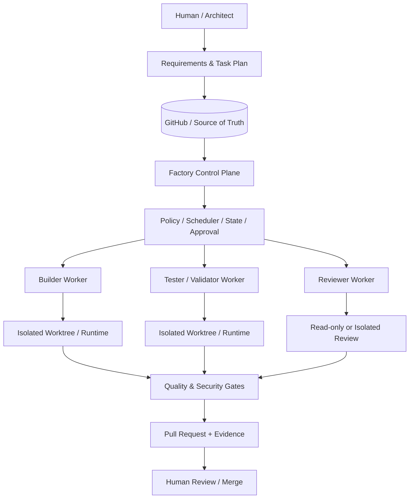

# AI Engineering Factory

[](https://github.com/moruku36/ai-engineering-factory/actions/workflows/ci.yml)

> A safety-first, repository-centric harness for turning an engineering plan into isolated AI-agent tasks, validated changes, review evidence, and a human-approved pull request.

**Project status: Experimental / integration-verified.** The core control-plane, isolation, approval, validation, Antigravity adapter, and GitHub publishing paths have been implemented and tested, but this project should still be treated as an engineering experiment rather than a production autonomous-development platform. See [PROJECT_STATE.md](PROJECT_STATE.md) for the current operational status and known limitations.

## What is this?

AI coding tools are good at generating code, but longer engineering work becomes harder when several agents, sessions, branches, tests, and approval boundaries are involved. The main problem is no longer just *code generation*; it is coordinating work without losing state, letting agents overwrite each other, or silently crossing a security boundary.

AI Engineering Factory provides a lightweight control layer around that workflow:

```text
requirements / architecture
        ↓
machine-readable tasks
        ↓
isolated execution (branch + worktree + runtime namespace)
        ↓
build / test / independent review
        ↓
security + quality gates
        ↓
pull request + evidence
        ↓
human approval and merge
```

The repository itself is the long-lived source of truth. Task manifests, architecture decisions, rules, handoff notes, state projections, validation evidence, and Git history are intended to survive individual AI sessions and model context windows.

This is **not** another foundation model or a giant autonomous-agent framework. It is a deliberately small orchestration and governance layer that can sit around tools such as Google Antigravity and other coding agents through adapters.

## Why build it?

The project is designed around five recurring problems in agentic engineering:

- **Safe parallelism** — only independent tasks should run concurrently; tightly coupled work stays sequential.
- **Isolation** — each task receives its own branch/worktree and runtime namespace so agents do not trample the same files, ports, processes, temporary data, or state.
- **Durable memory** — important rules, task state, ADRs, progress, and handoff artifacts live in Git or durable runtime state rather than in one model's private memory.
- **Verifiable execution** — task completion means tests, validation, review evidence, and policy checks passed, not merely that an agent said "done".
- **Human control** — destructive operations, infrastructure changes, credentials, deployment, release, and merge remain explicit approval boundaries.

The design intentionally optimizes for **Safety → Reproducibility → Observability → Maintainability → Cost efficiency → Parallel throughput → Automation**, in that order.

## Architecture at a glance



The architecture separates the **Control Plane** (schemas, policy, state, scheduling, approvals, publishing) from **Workers** (bounded execution). Antigravity is integrated through an adapter so the Factory core does not have to depend on one agent runtime.

For details, see [ARCHITECTURE.md](ARCHITECTURE.md), [AGENTS.md](AGENTS.md), and the [architecture documentation](docs/architecture/).

## Current capabilities

The current implementation includes:

- schema-driven task and state handling;
- dependency-aware scheduling and task lifecycle management;
- isolated worktree/path/process handling and runtime resource coordination;
- persistent state and retry tracking;
- cryptographically bound, single-use approval tokens;
- registered-command execution boundaries;
- a native Antigravity adapter plus manual/test adapters;
- GitHub publishing with remote SHA verification and idempotent PR handling;
- secret scanning, dependency auditing, linting, and Linux/Windows CI;
- operator CLI commands for diagnostics, status, approval, and cancellation.

Not every combination of agent runtime, OS, cloud provider, or infrastructure workflow has been validated. Check [PROJECT_STATE.md](PROJECT_STATE.md), [OPERATIONS.md](OPERATIONS.md), and the [compatibility matrix](docs/compatibility/matrix.md) before relying on a capability.

## Quick start for contributors

Requirements: Python 3.11+, Git, and the development dependencies in this repository.

```bash
python -m venv .venv
# Activate the virtual environment for your shell, then:
pip install -r requirements.txt

python -m orchestrator.cli doctor
ruff check orchestrator scripts tests
python scripts/secret_scan.py
python scripts/audit_dependencies.py
pytest -v tests/
```

The `doctor` command can inspect a specific GitHub repository with `--repository owner/repo`. Antigravity-specific execution also requires a compatible local Antigravity runtime and the host's own authentication/quota.

Do **not** treat example tasks as authorization for cloud `apply`, deployment, credential changes, destructive operations, or production access. Those remain approval-gated by design.

## Repository map

- `orchestrator/` — Control Plane, state, policy, scheduling, execution adapters, publishing, and CLI.
- `schemas/` — machine-readable schemas for tasks, plans, results, state, approvals, and related artifacts.
- `tasks/` — task manifests, plans, active/completed examples, and workflow inputs.
- `state/` — versionable state projections and audit-oriented artifacts; transient runtime state stays outside Git.
- `.agents/` — repository-local rules and reusable skills/procedures for agents.
- `hooks/` — lifecycle and validation hooks.
- `scripts/` — security/quality validation utilities.
- `docs/` — architecture, ADRs, security, operations, compatibility, and design rationale.
- `.github/workflows/` — CI quality and security gates.

## Safety model

The Factory assumes that repositories, issues, pull requests, dependencies, prompts, and generated commands can all be untrusted inputs. The threat model therefore includes prompt injection, malicious repository content, command/shell injection, path traversal, secret leakage, unsafe dependency changes, and approval bypass attempts.

Human approval is intentionally retained for high-impact actions such as infrastructure apply/destroy, IAM or credential changes, public exposure, deployment/release, Git history rewriting, and merge. Automatic merge and unattended production deployment are non-goals.

See [SECURITY.md](SECURITY.md) and [docs/security/threat-model.md](docs/security/threat-model.md).

## Non-goals

This project is deliberately **not** trying to become:

- a 20–50 agent swarm for its own sake;
- fully unattended software development;
- an automatic production deployment system;
- an automatic merge bot;
- a framework that depends on one model's private memory;
- a microservice-heavy agent platform.

The intended progression is incremental: make a single-agent workflow reliable first, add multi-agent execution only where tasks are genuinely independent, and automate orchestration only after the safety/evidence boundaries are stable.

## Design influences and references

The architecture was informed by published work from Anthropic and Google on orchestrator-worker systems, parallel coding agents, long-running agent harnesses, planner/generator/evaluator patterns, structured handoffs, and multi-agent critique/verification loops.

See **[Design influences and references](docs/architecture/design-influences.md)** for the specific articles and how each idea maps into this repository.

This project is independently developed and is not affiliated with or endorsed by Anthropic, Google, OpenAI, or GitHub.

## Project documentation

- [Architecture](ARCHITECTURE.md)
- [Security policy](SECURITY.md)
- [Operations guide](OPERATIONS.md)
- [Contributing guide](CONTRIBUTING.md)
- [Agent specifications](AGENTS.md)
- [Project state](PROJECT_STATE.md)
- [ADRs](docs/adr/)
- [Design influences](docs/architecture/design-influences.md)

## License

No explicit open-source license has been selected yet. The repository is publicly viewable, but a license should be chosen before inviting third parties to reuse or redistribute the code as open source.
