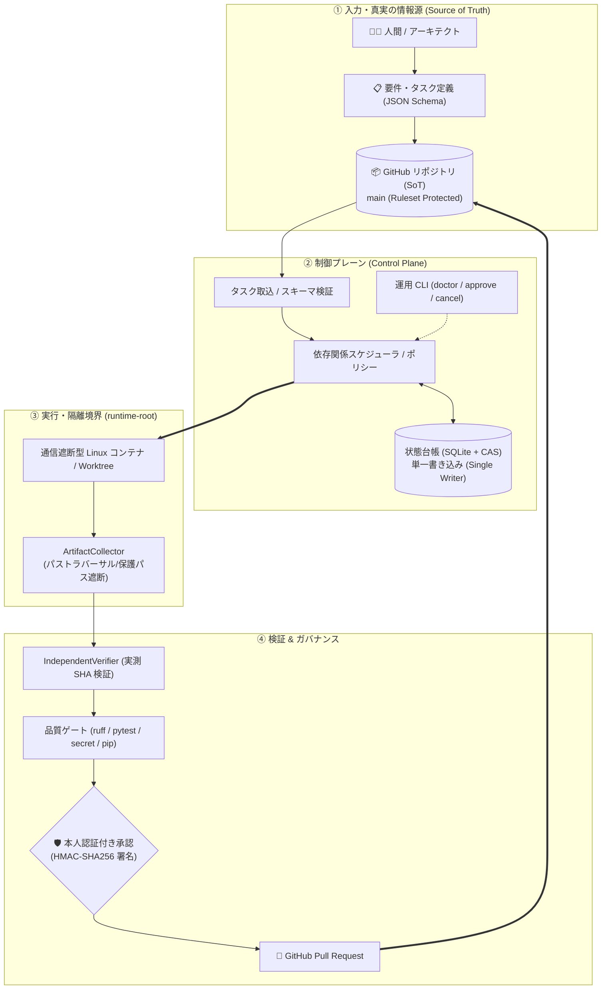

# AI Engineering Factory

[](https://github.com/moruku36/ai-engineering-factory/actions/workflows/ci.yml)

> **AIエージェントの実装を、隔離実行・検証証跡・人間承認付きPRに落とすためのガバナンス層です。新しいモデルでも巨大エージェント基盤でもありません。**

**現在のステータス: Experimental / MANUAL_ONLY**  
本番利用を前提とした完全自律開発プラットフォームではなく、AIエージェントを使ったソフトウェア開発を安全に工程化するための実験的な基盤です。現在の状態と制約は [PROJECT_STATE.md](PROJECT_STATE.md) を参照してください。

---

## 🎯 対象読者

| 向いている人 | 向いていない人 |
| :--- | :--- |
| • AIエージェントに自律実装させたいが、リポジトリ破壊や危険な操作を防ぎたい人 | • ワンクリックで何でもやってくれる完全自律ボットを探している人 |
| • エージェントの「Done」自己申告を信用せず、独立したテストと証跡で品質を担保したい人 | • 対話型チャットUIだけで完結させたい人 |
| • チームのPR・レビュー規約・承認フローをエージェントにも強制したい人 | • 実行環境のOS隔離やプロセスの後始末を気にしない人 |

---

## ⚖️ 現在できること / できないこと

エージェント基盤そのものを自作するのではなく、**外部エージェントを信用せずに安全に管理する**ことに特化しています。

| 今できること (Implemented & Verified) | 今できないこと (Out of Scope / Blocked) |
| :--- | :--- |
| **厳格なスキーマ & DAGスケジューリング**<br>JSON Schema (2020-12) に基づくタスク検証と依存関係の自動解決 | **Antigravityネイティブ実行 (BLOCKED)**<br>公式バッチCLI/コンテナSDKが未提供のため安全側に倒して拒否（架空接続は禁止） |
| **通信遮断型コンテナ隔離 & 成果物回収**<br>ネットワーク遮断Linuxコンテナでの実行と、パストラバーサルや保護パスを遮断した回収 | **完全自動マージ / 自動デプロイ**<br>すべてのマージや重要操作は人間の明示的レビュー・承認を必須とするガバナンス |
| **独立検証器 (Independent Verifier)**<br>エージェントの自己申告テストログを排除し、差分から実測 `candidate_sha` を照合 | **暗黙のフォールバック**<br>障害や非対応時に自動で安全基準の低い実行モードへすり替える動作は禁止 (Fail-Closed) |
| **本人認証付き承認 (Approval Token)**<br>HMAC-SHA256署名鍵とロール権限に基づく単回利用の暗号学的承認トークン管理 | |
| **2相コミット操作ジャーナル**<br>SQLiteトランザクションによるGitHub操作の重複防止とクラッシュ復旧照合 | |
| **GitHub Ruleset ブランチ保護**<br>`main` ブランチへの直push / force push禁止、およびCI通過必須化の強制 | |
| **プロセスの安全停止**<br>タスクキャンセル時にアクティブなプロセスツリーを強制終了し、停止を確認してから状態遷移 | |

---

## 🚀 クイックツアー: 最初の1タスクを動かす (Golden Path)

AI Engineering Factory の一連の流れは、**「タスク定義 → 取込・検証 → 隔離実行 → 証跡生成 → 人手承認 → PR作成」** です。

### 1. タスク仕様の確認 (`tasks/examples/sample-task.yaml`)
エージェントへの作業指示は、自然言語のチャットではなく機械可読なタスク定義として記述します。
```yaml
schema_version: "2020-12"
id: "SMP-001"
title: "Implement Core Health Check Endpoint"
role: "builder"
repository: "https://github.com/moruku36/ai-engineering-factory"
base_ref: "main"
branch: "task/smp-001"
allowed_paths:
  - "orchestrator/"
prohibited_paths:
  - ".github/"
  - "schemas/"
validation:
  - command_id: "pytest"
    timeout_seconds: 300
```

### 2. 環境診断と状態確認
```bash
# 仮想環境の準備と依存パッケージのインストール
python -m venv .venv
# (OSに合わせて .venv をアクティベート)
pip install -r requirements.txt

# リポジトリと環境の健全性診断
python -m orchestrator.cli doctor

# 状態台帳の確認
python -m orchestrator.cli status
```

### 3. 本人認証付き承認の発行
タスク実行やPR作成などの重要操作を行うには、オペレーターの秘密鍵を用いた署名付き承認を発行します。
```bash
python -m orchestrator.cli approve \
  --task-id SMP-001 \
  --scope task_execution \
  --approver-id alice \
  --key-file /path/to/signing.key \
  --registry-file config/approvers.json
```

### 4. 品質ゲートの自己検査
```bash
# 静的解析
ruff check orchestrator scripts tests

# 秘密情報漏洩スキャン
python scripts/secret_scan.py

# 依存関係整合性確認
python scripts/audit_dependencies.py

# 回帰テストスイート
pytest -v tests/
```

---

## 📚 用語集 (Glossary)

初めて本リポジトリを読むエンジニア向けの主要キーワードです。

| 用語 | 説明 |
| :--- | :--- |
| **SoT (Source of Truth)** | リポジトリのGitコミットおよびPR履歴。エージェントの一時記憶ではなく、リポジトリこそが真実の情報源です。 |
| **CAS (Compare-And-Swap)** | SQLite状態台帳の楽観的並行性制御。リビジョン番号を照合し、並列ワーカーによる競合や状態破壊を防ぎます。 |
| **runtime-root** | リポジトリ外に配置される使い捨て実行領域。生ログ、PID、一時DBをGit管理外へ完全隔離します。 |
| **Evidence Bundle** | テストログ、実行結果、成果物から計算された実測 `candidate_sha` を含む、改ざん不能な検証証跡。 |
| **Fail-Closed** | 異常、未認証、未検証項目に遭遇した際、例外をもみ消さずに「安全側に倒して即時拒絶（ブロック）」する設計思想。 |
| **Worktree** | Gitの複数ブランチを別ディレクトリに同時チェックアウトする機能。タスクごとのコード隔離に使用します。 |
| **Lease** | タスク実行権限の有効期限。タイムアウトやプロセス生存確認（PID監視）によりデッドロックを防止します。 |
| **Approval Token** | 人間オペレーターが署名鍵を用いて発行する、暗号学的に保護された単回消費型の承認証。 |
| **Adapter** | 外部のエージェントランタイム（Container, Manual, Antigravity等）と制御プレーンを繋ぐ抽象化層。 |
| **MANUAL_ONLY** | 現在の動作モード。完全自律ではなく、すべての重要操作に人間の介在を必須とする状態。 |

---

## 🏛️ システムアーキテクチャ概要

本システムは、AIエージェントに直接操作を許さず、**制御プレーン（Control Plane）** が単一の状態台帳（Single Writer + CAS）と厳格なスキーマによって全プロセスを統制します。

```text
要件定義 / 仕様策定 (JSON Schema)
        ↓
Machine-readableなTaskへ分割
        ↓
通信遮断コンテナ / Worktree で隔離実行
        ↓
独立検証器による証跡生成 (Evidence Bundle)
        ↓
品質ゲート検査 (Lint / Test / Secret Scan / Consistency)
        ↓
署名鍵による本人認証付き承認 (Human Approval)
        ↓
Pull Request 作成 → 人間による最終マージ
```



> **詳細仕様**: 各コンポーネントの厳格な境界条件、状態遷移ライフサイクル、権限マトリクスは [ARCHITECTURE.md](ARCHITECTURE.md) を参照してください。


実際に利用する前に [PROJECT_STATE.md](PROJECT_STATE.md)、[OPERATIONS.md](OPERATIONS.md)、[Compatibility Matrix](docs/compatibility/matrix.md) を確認してください。

## 🛠️ 開発者・コントリビュータ向け検証 (Self-Test)

本基盤自体のコード修正やプルリクエスト作成時には、以下の自己検査を実行します。

```bash
# 静的解析 (Ruff)
ruff check orchestrator scripts tests

# 秘密情報漏洩スキャン (Fail-Closed)
python scripts/secret_scan.py

# 依存関係整合性確認 (pip check)
python scripts/audit_dependencies.py

# 回帰テストスイートの全実行 (193 tests)
pytest -v tests/
```

> **注意**: 本基盤の実行は現在「通信遮断型 Linux コンテナ (`OfflineContainerRunner`)」および「手動/モック (`ManualAdapter`)」が標準経路です。Google Antigravity Native Runtime は公式SDKが未整備なため現在 `BLOCKED` 判定としており、Antigravity の環境がなくても本基盤の全テスト・隔離実行機能は検証可能です。


## Repository構成

- `orchestrator/` — Control Plane、State、Policy、Scheduling、Execution Adapter、Publishing、CLI
- `schemas/` — Task、Plan、Result、State、ApprovalなどのMachine-readable Schema
- `tasks/` — Task Manifest、Plan、Active / Completed Example、Workflow Input
- `state/` — Version管理可能なState ProjectionやAudit Artifact。Transient Runtime StateはGit外に保存
- `.agents/` — Agent向けRepository-local Rule、Skill、Procedure
- `hooks/` — Lifecycle / Validation Hook
- `scripts/` — Security / Quality Validation Utility
- `docs/` — Architecture、ADR、Security、Operations、Compatibility、Design Rationale
- `.github/workflows/` — CIによるQuality / Security Gate

## Safety Model

Factoryは、Repository、Issue、Pull Request、Dependency、Prompt、Generated Commandなどをすべて潜在的にUntrusted Inputとして扱います。

Threat Modelには、以下を含みます。

- Prompt Injection
- Malicious Repository Content
- Malicious Issue / Pull Request
- Command / Shell Injection
- Path Traversal
- Secret Leakage
- Malicious Dependency
- Approval Bypass

Infrastructure Apply / Destroy、IAM / Credential変更、Public Exposure、Deployment / Release、Git History Rewrite、MergeなどのHigh-impact Operationは、Human Approvalを必要とします。

Automatic MergeやUnattended Production Deploymentは、このFactoryの目標ではありません。

詳細は [SECURITY.md](SECURITY.md) と [Threat Model](docs/security/threat-model.md) を参照してください。

## やらないこと

このプロジェクトでは、次のようなものを目標にしていません。

- Agent数を増やすこと自体を目的にした20〜50 Agent規模のSwarm
- 完全無人のSoftware Development
- ProductionへのAutomatic Deployment
- Automatic Merge Bot
- 特定モデルのPrivate Memoryへの全面依存
- Factoryを作るためだけの巨大なMicroservices / Agent Platform

まずSingle Agentでも確実に動作するWorkflowを作り、その後、本当に独立しているTaskだけMulti-Agent化し、安全性とEvidenceの境界が安定してからOrchestrationを自動化する、というIncremental Architectureを採用しています。

## 設計の参考にした資料

このFactoryの設計では、AnthropicやGoogleが公開している以下の考え方を参考にしています。

- Orchestrator–Worker Pattern
- Parallel Coding Agents
- Long-running Agent Harness
- Planner / Generator / Evaluator
- Structured Handoff
- Multi-Agent Critique / Verification Loop

特に、複数Agentを無制限に増やすのではなく、**依存関係を分析し、本当に独立したTaskだけを並列化する**という考え方を重視しています。

参考にした記事と、それぞれがFactoryのどの設計に反映されているかは、**[設計に影響した資料・参考文献](docs/architecture/design-influences.md)** に整理しています。

このプロジェクトは独立して開発しているものであり、Anthropic、Google、OpenAI、GitHubの公式プロジェクトではありません。

## Documentation

- [Architecture](ARCHITECTURE.md)
- [Security Policy](SECURITY.md)
- [Operations Guide](OPERATIONS.md)
- [Contributing Guide](CONTRIBUTING.md)
- [Agent Specifications](AGENTS.md)
- [Project State](PROJECT_STATE.md)
- [ADR](docs/adr/)
- [設計に影響した資料・参考文献](docs/architecture/design-influences.md)

## License

現在、明示的なOpen Source Licenseは選択していません。

Repository自体はPublicですが、第三者による再利用・改変・再配布をOpen Sourceとして許可する場合は、MIT LicenseやApache License 2.0など、利用方針に合ったLicenseを別途選択する必要があります。

