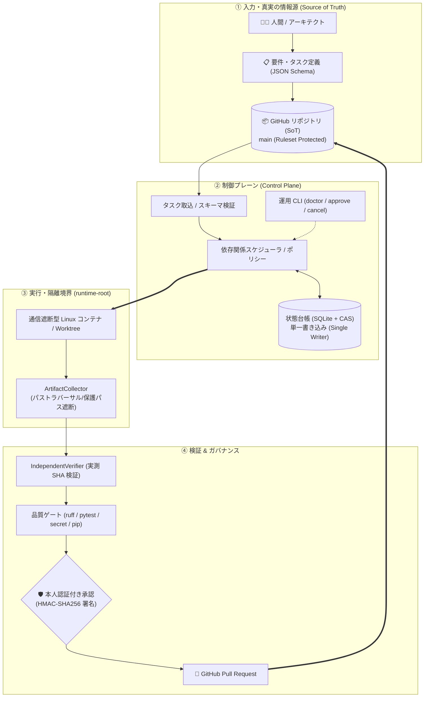

# AI Engineering Factory

[](https://github.com/moruku36/ai-engineering-factory/actions/workflows/ci.yml)

> **AIエージェントの実装を、隔離実行・検証証跡・人間承認付きPRに落とすためのガバナンス層です。新しいモデルでも巨大エージェント基盤でもありません。**

**現在のステータス: Experimental / MANUAL_ONLY (MIT License)**  
本番利用を前提とした完全自律開発プラットフォームではなく、AIエージェントを使ったソフトウェア開発を安全に工程化するための実験的な基盤です。現在の状態と制約は [PROJECT_STATE.md](PROJECT_STATE.md) を参照してください。

**⚡ 自分の環境で試す**: [15分クイックスタート (docs/getting-started.md)](docs/getting-started.md) — clone → `doctor` → `init` → サンプルタスク実行 → Evidence確認までの一本道シナリオです。

**🧪 実戦Case Study**: [Web Security Control Lab — Phase Boundary / Human Merge Boundaryを実環境で検証](docs/case-studies/web-security-control-lab.md) — 実際のAgent分担が崩れた事例から、`phase_contract`・PR HEAD binding・Fail-ClosedなHuman Merge境界へ改善した経緯をまとめています。

### 環境ごとにできること

| 環境 | CLI / 開発・テスト | Offline Container Isolation |
| :--- | :---: | :---: |
| Linux | ✅ CI Verified | ✅ CI Verified (Docker必須) |
| Windows | ✅ CI Verified | ❌ 未対応 (Linuxコンテナ前提) |
| macOS | ⚠️ Expected (未CI検証) | ❌ 未対応 |

「Docker Desktopが入っているから動くだろう」と思って`OfflineContainerRunner`をWindows/macOSで使おうとすると失敗します。隔離実行が必要な場合はLinux (またはWSL2、要検証) を使ってください。詳細は [Compatibility Matrix](docs/compatibility/matrix.md) を参照してください。

---

## 🎯 対象読者

| 向いている人 | 向いていない人 |
| :--- | :--- |
| • AIエージェントに自律実装させたいが、リポジトリ破壊や危険な操作を防ぎたい人 | • ワンクリックで何でもやってくれる完全自律ボットを探している人 |
| • エージェントの「Done」自己申告を信用せず、独立したテストと証跡で品質を担保したい人 | • 対話型チャットUIだけで完結させたい人 |
| • チームのPR・レビュー規約・承認フローをエージェントにも強制したい人 | • 実行環境のOS隔離やプロセスの後始末を気にしない人 |

---

## ⚖️ 現在できること / できないこと

エージェント基盤そのものを自作するのではなく、**外部エージェントを信用せずに安全に管理する**ことに特化しています。

| 今できること (Implemented & Verified) | 今できないこと (Out of Scope / Blocked) |
| :--- | :--- |
| **厳格なスキーマ & DAGスケジューリング**<br>JSON Schema (2020-12) に基づくタスク検証と依存関係の自動解決 | **Antigravityネイティブ実行 (BLOCKED)**<br>公式バッチCLI/コンテナSDKが未提供のため安全側に倒して拒否（架空接続は禁止） |
| **通信遮断型コンテナ隔離 & 成果物回収**<br>ネットワーク遮断Linuxコンテナでの実行と、パストラバーサルや保護パスを遮断した回収 | **完全自動マージ / 自動デプロイ**<br>すべてのマージや重要操作は人間の明示的レビュー・承認を必須とするガバナンス |
| **独立検証器 (Independent Verifier)**<br>エージェントの自己申告テストログを排除し、差分から実測 `candidate_digest` を照合 | **暗黙のフォールバック**<br>障害や非対応時に自動で安全基準の低い実行モードへすり替える動作は禁止 (Fail-Closed) |
| **本人認証付き承認 (Approval Token)**<br>HMAC-SHA256署名鍵とロール権限に基づく単回利用の暗号学的承認トークン管理 | **CLIによるワンライナー自律実行**<br>誤認防止のため単一の `run` / `ingest` CLIは提供せず、Python APIやテスト経由で制御 |
| **2相コミット操作ジャーナル**<br>SQLiteトランザクションによるGitHub操作の重複防止とクラッシュ復旧照合 | |
| **GitHub Ruleset ブランチ保護**<br>`main` ブランチへの直push / force push禁止、およびCI通過必須化の強制 | |
| **プロセスの安全停止**<br>タスクキャンセル時にアクティブなプロセスツリーを強制終了し、停止を確認してから状態遷移 | |

---

## 🚀 ライフサイクルの実像: 1つのタスクがPRになるまで

AI Engineering Factory では、エージェントによる独断実行を許さないため、**CLIの一発自動実行コマンド (`run` / `ingest`) は意図的に提供していません**。タスクの取込・隔離実行・証跡照合は CLI (`init` / `demo` / `doctor` / `approve`) と Python API (`ApprovedContainerLoop`, `OfflineContainerRunner`, `IndependentVerifier`) を組み合わせて段階的に制御します。

以下はフローの要約です。**自分のリポジトリで実際に手を動かして試す場合は、[15分クイックスタート](docs/getting-started.md) を参照してください**（`tasks/templates/basic-task.yaml` をテンプレートとして使い、`moruku36/ai-engineering-factory` のようなこのリポジトリ固有の値は自分の `owner/repo` に置き換えます）。

### 1. タスク仕様の定義
エージェントへの作業指示は、自然言語チャットではなく機械可読なタスク定義（YAML）として記述します（`schema_version`、`allowed_paths`、`validation`、`approval` などを持つスキーマ検証済みの構造体）。実例はこのリポジトリ自身を対象にした [`tasks/examples/sample-task.yaml`](tasks/examples/sample-task.yaml)、自分のリポジトリ向けのひな形は [`tasks/templates/basic-task.yaml`](tasks/templates/basic-task.yaml) を参照してください。

### 2. 診断・実行・承認の最小例
```bash
pip install -e ".[dev]"
python -m orchestrator.cli doctor                              # 環境診断（Exit 2 = 正常 + MANUAL_ONLY）
python -m orchestrator.cli init --repository owner/repo        # 設定 + runtime-root を作成
python -m orchestrator.cli demo --task-file tasks/examples/sample-task.yaml --worktree .
```
`demo` は非隔離のローカル実行（`ManualAdapter`）でタスク→検証→Evidenceの流れを素早く確認するためのものです。信頼できないコードには使わないでください。通信遮断コンテナでの隔離実行・独立検証（Python API）と、マージ前の人手承認トークン発行（CLI `approve`）を含む全ステップは **[15分クイックスタート](docs/getting-started.md)** に一本道でまとめています。

---

## 📚 用語集 (Glossary)

主要キーワードは **[docs/glossary.md](docs/glossary.md)** にまとめています。

---

## 🏛️ システムアーキテクチャ概要

本システムは、AIエージェントに直接操作を許さず、**制御プレーン（Control Plane）** が単一の状態台帳（Single Writer + CAS）と厳格なスキーマによって全プロセスを統制します。

> 下図は現在リポジトリに実装されている範囲のみを描いています。Redis / S3 / Slack / Notion 連携やCI/CDでの自動デプロイなどは将来構想であり、現時点では実装されていません（詳細は [PROJECT_STATE.md](PROJECT_STATE.md) を参照）。



> **詳細仕様**: 各コンポーネントの厳格な境界条件、状態遷移ライフサイクル、権限マトリクスは [ARCHITECTURE.md](ARCHITECTURE.md) を参照してください。


実際に利用する前に [PROJECT_STATE.md](PROJECT_STATE.md)、[OPERATIONS.md](OPERATIONS.md)、[Compatibility Matrix](docs/compatibility/matrix.md) を確認してください。

## 🛠️ 開発者・コントリビュータ向け検証 (Self-Test)

本基盤自体のコード修正やプルリクエスト作成時には、以下の自己検査を実行します。

```bash
# 静的解析 (Ruff)
ruff check orchestrator scripts tests

# 秘密情報漏洩スキャン (Fail-Closed)
python scripts/secret_scan.py

# 依存関係整合性確認 (pip check)
python scripts/audit_dependencies.py

# 回帰テストスイートの全実行 (193 tests)
pytest -v tests/
```

> **注意**: 本基盤の実行は現在「通信遮断型 Linux コンテナ (`OfflineContainerRunner`)」および「手動/モック (`ManualAdapter`)」が標準経路です。Google Antigravity Native Runtime は公式SDKが未整備なため現在 `BLOCKED` 判定としており、Antigravity の環境がなくても本基盤の全テスト・隔離実行機能は検証可能です。


## Repository構成

- `orchestrator/` — Control Plane、State、Policy、Scheduling、Execution Adapter、Publishing、CLI
- `schemas/` — Task、Plan、Result、State、ApprovalなどのMachine-readable Schema
- `tasks/` — Task Manifest、Plan、Active / Completed Example、Workflow Input（`tasks/templates/` に自分のリポジトリ向けひな形）
- `state/` — Version管理可能なState ProjectionやAudit Artifact。Transient Runtime StateはGit外に保存
- `.agents/` — Agent向けRepository-local Rule、Skill、Procedure
- `hooks/` — Lifecycle / Validation Hook
- `scripts/` — Security / Quality Validation Utility
- `docs/` — Architecture、ADR、Security、Operations、Compatibility、Design Rationale
- `.github/workflows/` — CIによるQuality / Security Gate

## Safety Model

Factoryは、Repository、Issue、Pull Request、Dependency、Prompt、Generated Commandなどをすべて潜在的にUntrusted Inputとして扱います。

Threat Modelには、以下を含みます。

- Prompt Injection
- Malicious Repository Content
- Malicious Issue / Pull Request
- Command / Shell Injection
- Path Traversal
- Secret Leakage
- Malicious Dependency
- Approval Bypass

Infrastructure Apply / Destroy、IAM / Credential変更、Public Exposure、Deployment / Release、Git History Rewrite、MergeなどのHigh-impact Operationは、Human Approvalを必要とします。

Automatic MergeやUnattended Production Deploymentは、このFactoryの目標ではありません。

詳細は [SECURITY.md](SECURITY.md) と [Threat Model](docs/security/threat-model.md) を参照してください。

## やらないこと

このプロジェクトでは、次のようなものを目標にしていません。

- Agent数を増やすこと自体を目的にした20〜50 Agent規模のSwarm
- 完全無人のSoftware Development
- ProductionへのAutomatic Deployment
- Automatic Merge Bot
- 特定モデルのPrivate Memoryへの全面依存
- Factoryを作るためだけの巨大なMicroservices / Agent Platform

まずSingle Agentでも確実に動作するWorkflowを作り、その後、本当に独立しているTaskだけMulti-Agent化し、安全性とEvidenceの境界が安定してからOrchestrationを自動化する、というIncremental Architectureを採用しています。

## 設計の参考にした資料

このFactoryの設計では、AnthropicやGoogleが公開している以下の考え方を参考にしています。

- Orchestrator–Worker Pattern
- Parallel Coding Agents
- Long-running Agent Harness
- Planner / Generator / Evaluator
- Structured Handoff
- Multi-Agent Critique / Verification Loop

特に、複数Agentを無制限に増やすのではなく、**依存関係を分析し、本当に独立したTaskだけを並列化する**という考え方を重視しています。

参考にした記事と、それぞれがFactoryのどの設計に反映されているかは、**[設計に影響した資料・参考文献](docs/architecture/design-influences.md)** に整理しています。

このプロジェクトは独立して開発しているものであり、Anthropic、Google、OpenAI、GitHubの公式プロジェクトではありません。

## Documentation

- [Getting Started (15分クイックスタート)](docs/getting-started.md)
- [用語集 (Glossary)](docs/glossary.md)
- [Case Study: Web Security Control Lab](docs/case-studies/web-security-control-lab.md) — Phase Boundary / Human Merge Boundaryの実戦検証
- [Adapter Guide](docs/adapters/README.md) — Claude Code / Codex / 独自Adapterの繋ぎ方
- [Architecture](ARCHITECTURE.md)
- [Security Policy](SECURITY.md)
- [Operations Guide](OPERATIONS.md)
- [Contributing Guide](CONTRIBUTING.md)
- [Agent Specifications](AGENTS.md)
- [Project State](PROJECT_STATE.md)
- [Compatibility Matrix](docs/compatibility/matrix.md)
- [ADR](docs/adr/)
- [設計に影響した資料・参考文献](docs/architecture/design-influences.md)

## License

[MIT License](LICENSE) を採用しています。

