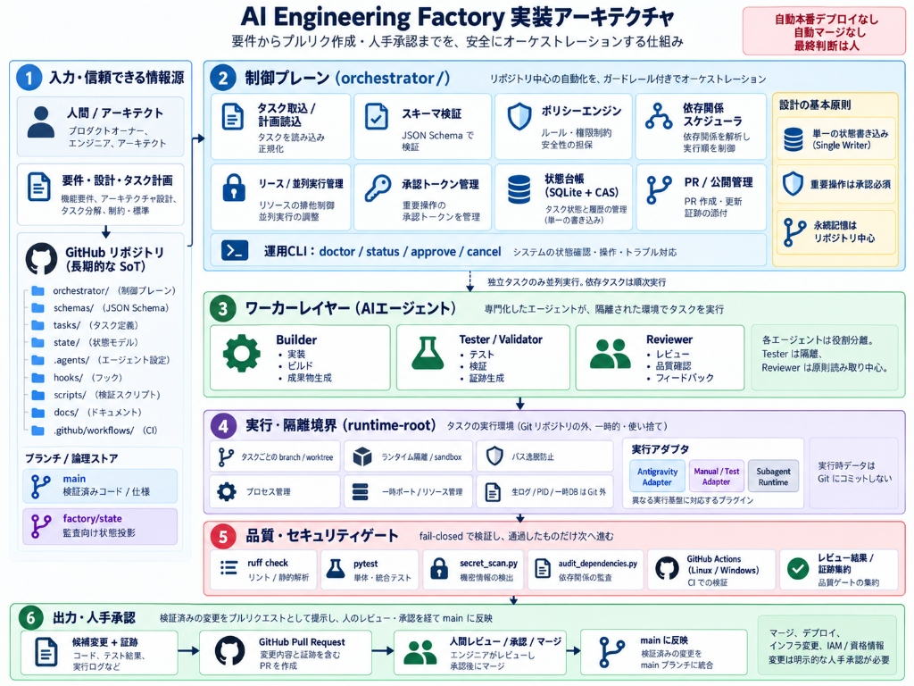
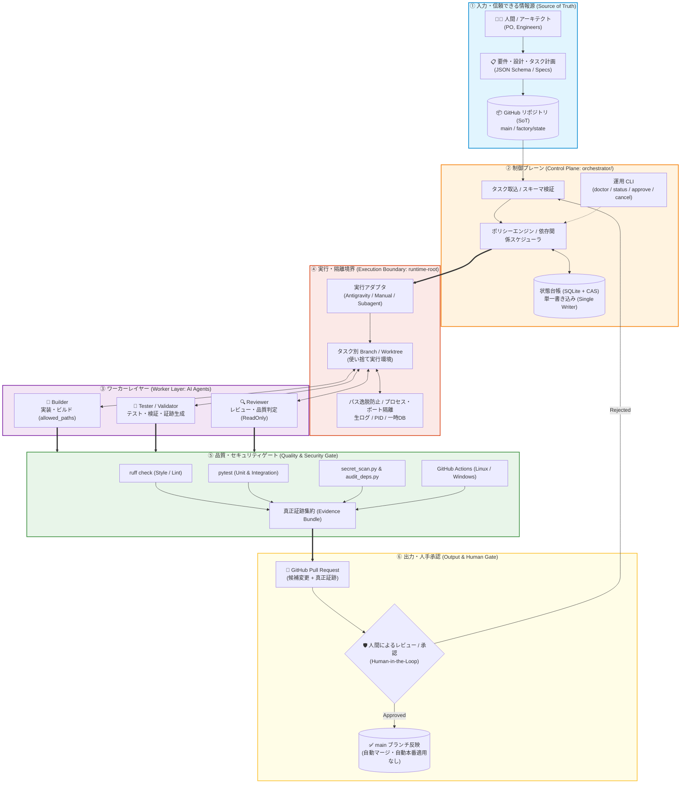
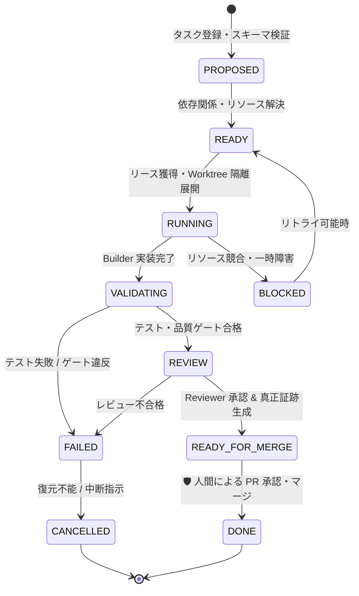

# AI Engineering Factory

[](https://github.com/moruku36/ai-engineering-factory/actions/workflows/ci.yml)

> エンジニアリング計画を、分離されたAIエージェントのタスク、検証済みの変更、レビュー証跡、そして人間が承認するPull Requestへつなげるための、安全性を重視したリポジトリ中心の開発基盤です。

**現在のステータス: Experimental / MANUAL_ONLY**  
OS隔離、本人認証を伴う承認、Antigravity実接続は未完成です。[最新の完成評価](docs/operations/POST_PR7_REVIEW.md) を参照してください。ただし、現時点では本番利用を前提とした完全自律開発プラットフォームではなく、AIエージェントを使ったソフトウェア開発を安全に工程化するための実験的な基盤です。現在の状態と制約は [PROJECT_STATE.md](PROJECT_STATE.md) を参照してください。

## これは何？

AIコーディングツールはコード生成そのものは得意ですが、作業が長期化し、複数のAgent、Session、Branch、Test、Review、Approvalが関わるようになると、単純なコード生成だけでは管理が難しくなります。

特に問題になるのは、次のような点です。

- Agent同士が同じファイルや作業環境を壊してしまう
- どこまで作業が終わったのか分からなくなる
- Sessionが切り替わると前のAgentの判断や進捗が失われる
- Agentが「完了した」と言っていても、本当にテストやレビューが通っているとは限らない
- 複数Agentを増やした結果、かえってコストや調整作業が増える
- Cloud、IAM、Credential、Deployなどの危険な操作まで自動化してしまう

AI Engineering Factory は、こうした問題を解決するために、AIエージェント開発の周囲に**軽量なOrchestration / Governanceレイヤー**を追加します。

```text
要件定義 / アーキテクチャ設計
        ↓
Machine-readableなTaskへ分割
        ↓
Branch + Worktree + Runtime Namespaceで分離
        ↓
実装 / テスト / 独立レビュー
        ↓
Security & Quality Gate
        ↓
Pull Request + Evidence
        ↓
Human Review / Merge
```

このFactoryでは、GitHub Repositoryを長期的な **Source of Truth** として扱います。

Task Manifest、Architecture Decision、Rule、Skill、進捗、Handoff、Validation Evidence、Git historyなどをRepositoryまたは永続Stateに残すことで、特定のAIモデルのMemoryや1回のSessionに依存しない開発を目指します。

これは新しいFoundation Modelでも、巨大なAgent Frameworkでもありません。Google AntigravityなどのAIコーディング環境や他のAgent Runtimeの外側に置き、**設計 → タスク分割 → 実装 → 検証 → レビュー → PR** を安全かつ再現可能に回すための基盤です。

## なぜ作ったのか

このプロジェクトでは、Agentic Engineeringで繰り返し発生する5つの課題を中心に設計しています。

- **安全な並列化**  
  独立したTaskだけを並列実行し、依存関係が強い作業は無理に並列化しません。

- **実行環境の分離**  
  TaskごとにBranch / Worktree / Runtime Namespaceを分け、ファイルだけでなくPort、Process、Temporary Data、Stateなどの衝突も防ぎます。

- **永続的なMemory / Handoff**  
  Rule、Task State、ADR、Progress、HandoffをGitや永続Stateに保存し、1つのモデルやSessionの内部Memoryに依存しません。

- **検証可能な完了条件**  
  Agentが「Done」と回答するだけでは完了としません。Test、Validation、Review Evidence、Policy Checkなど、Machine-readableな証跡を要求します。

- **Human Control**  
  Destructive Operation、Infrastructure Apply、Credential、IAM、Deployment、Release、Mergeなどの重要操作にはHuman Approvalを残します。

設計上の優先順位は次の通りです。

**Safety → Reproducibility → Observability → Maintainability → Cost Efficiency → Parallel Throughput → Automation**

自動化そのものを目的にせず、安全性と再現性を優先します。

## 🏛️ System Architecture



以下の図・役割・遷移は目標設計です。現在のコードが全境界を強制することを示すものではありません。

AI Engineering Factory は、AI エージェントに自由な直接操作を許さず、**制御プレーン（Control Plane）** が単一の状態台帳（Single Writer + CAS）と厳格なスキーマによって全プロセスを統制します。作業はすべて Git 管理外の使い捨て実行境界（`runtime-root`）で行われ、人手承認（Human-in-the-loop）を経て初めて `main` ブランチへマージされます。



### 📊 アーキテクチャ 6 ステージ対照表

| ステージ | 主要コンポーネント | 責務と役割 | セキュリティ & 整合性制御 |
| :--- | :--- | :--- | :--- |
| **① 入力・信頼できる情報源**<br>*(Source of Truth)* | • 人間 / アーキテクト<br>• 要件・仕様・タスク定義<br>• GitHub リポジトリ (`main`, `factory/state`) | • 開発要件・受け入れ基準の定義<br>• 長期的な真実の情報源 (SoT)<br>• 監査向け状態の投影 | • `main` ブランチ保護（直接 push 厳禁）<br>• JSON Schema 2020-12 によるスキーマ制約<br>• 監査用ブランチの独立管理 |
| **② 制御プレーン**<br>*(Control Plane)* | • `orchestrator.engine`<br>• `PolicyEngine`<br>• `StateLedger` (SQLite + CAS)<br>• 運用 CLI (`doctor`, `approve`, etc.) | • タスク取込と依存関係スケジューリング<br>• 単一ライターによる状態管理<br>• 承認トークン発行・検証 | • **Single Writer**: 状態更新の直列化<br>• **Fail-Closed Policy**: 不正遷移・不正コマンド拒否<br>• **Human-in-the-Loop**: 重要操作は承認必須 |
| **③ ワーカーレイヤー**<br>*(Worker Layer)* | • **Builder Agent**<br>• **Tester / Validator Agent**<br>• **Reviewer Agent** | • コード実装・修正<br>• テスト実行・検証・生ログ取得<br>• 独立したコードレビュー・合否判定 | • 役割に応じた最小権限分離<br>• `allowed_paths` による書込スコープ限定<br>• レビュアーの読み取り専用強制 |
| **④ 実行・隔離境界**<br>*(Execution Boundary)* | • `runtime-root`<br>• Git Worktree 隔離空間<br>• 実行アダプタ (Antigravity / Manual) | • 使い捨て環境でのタスク並行実行<br>• プロセス・一時ポート・PID管理<br>• 外部ランタイムと基盤の通信仲介 | • リポジトリ SoT 外での隔離実行<br>• パス走査（Path Traversal）防止<br>• `shell=True` 排除・コマンドホワイトリスト |
| **⑤ 品質・セキュリティゲート**<br>*(Quality Gate)* | • `ruff check`<br>• `pytest`<br>• `secret_scan.py`<br>• `audit_dependencies.py`<br>• GitHub Actions (Linux / Win) | • 静的解析・スタイル検証<br>• 単体・結合テスト自動検証<br>• 秘密情報漏洩・依存脆弱性検知<br>• クロスプラットフォーム CI 検査 | • 1 項目でも失敗時は即時ブロック (Fail-Closed)<br>• 真正証跡バンドル (Evidence Bundle) の署名・SHA-256 検証<br>• 監査ログの改ざん防止 |
| **⑥ 出力・人手承認**<br>*(Output & Human Gate)* | • GitHub Pull Request<br>• 人間レビュアー (Human Approver)<br>• `main` ブランチマージ | • 候補変更と証跡の提示<br>• 人間による最終コードレビュー<br>• 検証済み変更の本流統合 | • **自動マージの全面禁止**<br>• **自動本番適用の全面禁止**<br>• 人間の明示的承認による最終ガバナンス |

### 🤖 ワーカーエージェント権限マトリクス

エージェントごとの責務と権限は厳格に分離され、相互検証モデルを形成しています。

| エージェント | 主な責務 | ファイル書込権限 | 許可スコープ (`allowed_paths`) | 実行可能コマンド | 隔離セッション |
| :--- | :--- | :---: | :--- | :--- | :---: |
| **Builder** | コード実装、リファクタリング、ビルド | ✅ 許可 | 指定された実装ファイル・テストコードのみ | `git`, ビルドコマンド, フォーマッタ | 独立 Worktree |
| **Tester / Validator** | テスト実行、エビデンス収集、再現性確認 | ❌ 原則不可<br>*(証跡出力のみ)* | `runtime-root/.../evidence/` 配下のみ | `pytest`, テストランナー, カバレッジツール | 独立セッション |
| **Reviewer** | 仕様準拠性検査、セキュリティレビュー、承認判定 | ❌ 禁止 (Read-Only) | なし (ファイル変更不可) | 差分検査 (`git diff`), 静的解析ツール | 独立セッション |

### 🔄 状態遷移ライフサイクル (CAS State Progression)

タスクは制御プレーンの CAS (Compare-And-Swap) トランザクションによってのみ状態が進行します。



### 🔒 ガバナンス 3 本柱

```
  ┌─────────────────────────────────────────────────────────────┐
  │                 3つのコア・ガバナンス原則                   │
  └─────────────────────────────────────────────────────────────┘
   1. 単一の状態書き込み (Single Writer)
      - 状態遷移は SQLite + CAS 制御プレーンのみが行う。
      - 分散 Git ロックを排し、デッドロックや不整合を排除。
   
   2. 重要操作は人手承認必須 (Human-in-the-Loop)
      - 本番反映、外部通信、main マージはすべて人間が判断。
      - エージェントによる独断マージや本番デプロイは不可。

   3. 永続記憶はリポジトリ中心 (Git-backed SoT)
      - 仕様・コード・検証結果はすべて Git のコミットと証跡に残る。
      - ランタイムの一時データ (PID, 生ログ) は Git 外へ隔離。
```

詳細は [ARCHITECTURE.md](ARCHITECTURE.md)、[AGENTS.md](AGENTS.md)、[docs/architecture/](docs/architecture/) を参照してください。

## 現在できること

現在の実装には、主に以下が含まれています。

- SchemaベースのTask / State管理
- Dependency-aware SchedulerとTask Lifecycle管理
- Worktree、Path、Process、Runtime Resource管理（OS隔離は未実装）
- 永続StateとRetry管理
- 署名・単回消費の承認Token部品（Human本人認証は未実装）
- Registered Commandによる実行境界
- Manual / Test Adapter（Native実行は未実装として拒否）
- Remote SHA確認と重複PR防止を含むGitHub Publisher
- Secret Scan、依存関係整合性検査、Lint、Linux / Windows CI（CVE監査は未実装）
- Operator CLI（`approve`と実行中の`cancel`は安全条件未達のため拒否）

ただし、すべてのOS、Agent Runtime、Cloud Provider、Infrastructure Workflowの組み合わせを検証済みという意味ではありません。

実際に利用する前に [PROJECT_STATE.md](PROJECT_STATE.md)、[OPERATIONS.md](OPERATIONS.md)、[Compatibility Matrix](docs/compatibility/matrix.md) を確認してください。

## Quick Start

必要環境はPython 3.11以上、Git、およびこのRepositoryのDevelopment Dependenciesです。

```bash
python -m venv .venv
# 利用しているShellに応じてvirtual environmentを有効化した後:
pip install -r requirements.txt

python -m orchestrator.cli doctor
ruff check orchestrator scripts tests
python scripts/secret_scan.py
python scripts/audit_dependencies.py
pytest -v tests/
```

`doctor` は `--repository owner/repo` を指定することで、特定のGitHub Repositoryを診断できます。

Antigravityを使った実行には、互換性のあるローカルAntigravity Runtimeと、利用者自身のAuthentication / Quotaが必要です。

なお、Sample Taskが存在していても、それをCloud `apply`、Deployment、Credential変更、Destructive Operation、Production Accessの許可として扱ってはいけません。これらは設計上Human Approval対象です。

## Repository構成

- `orchestrator/` — Control Plane、State、Policy、Scheduling、Execution Adapter、Publishing、CLI
- `schemas/` — Task、Plan、Result、State、ApprovalなどのMachine-readable Schema
- `tasks/` — Task Manifest、Plan、Active / Completed Example、Workflow Input
- `state/` — Version管理可能なState ProjectionやAudit Artifact。Transient Runtime StateはGit外に保存
- `.agents/` — Agent向けRepository-local Rule、Skill、Procedure
- `hooks/` — Lifecycle / Validation Hook
- `scripts/` — Security / Quality Validation Utility
- `docs/` — Architecture、ADR、Security、Operations、Compatibility、Design Rationale
- `.github/workflows/` — CIによるQuality / Security Gate

## Safety Model

Factoryは、Repository、Issue、Pull Request、Dependency、Prompt、Generated Commandなどをすべて潜在的にUntrusted Inputとして扱います。

Threat Modelには、以下を含みます。

- Prompt Injection
- Malicious Repository Content
- Malicious Issue / Pull Request
- Command / Shell Injection
- Path Traversal
- Secret Leakage
- Malicious Dependency
- Approval Bypass

Infrastructure Apply / Destroy、IAM / Credential変更、Public Exposure、Deployment / Release、Git History Rewrite、MergeなどのHigh-impact Operationは、Human Approvalを必要とします。

Automatic MergeやUnattended Production Deploymentは、このFactoryの目標ではありません。

詳細は [SECURITY.md](SECURITY.md) と [Threat Model](docs/security/threat-model.md) を参照してください。

## やらないこと

このプロジェクトでは、次のようなものを目標にしていません。

- Agent数を増やすこと自体を目的にした20〜50 Agent規模のSwarm
- 完全無人のSoftware Development
- ProductionへのAutomatic Deployment
- Automatic Merge Bot
- 特定モデルのPrivate Memoryへの全面依存
- Factoryを作るためだけの巨大なMicroservices / Agent Platform

まずSingle Agentでも確実に動作するWorkflowを作り、その後、本当に独立しているTaskだけMulti-Agent化し、安全性とEvidenceの境界が安定してからOrchestrationを自動化する、というIncremental Architectureを採用しています。

## 設計の参考にした資料

このFactoryの設計では、AnthropicやGoogleが公開している以下の考え方を参考にしています。

- Orchestrator–Worker Pattern
- Parallel Coding Agents
- Long-running Agent Harness
- Planner / Generator / Evaluator
- Structured Handoff
- Multi-Agent Critique / Verification Loop

特に、複数Agentを無制限に増やすのではなく、**依存関係を分析し、本当に独立したTaskだけを並列化する**という考え方を重視しています。

参考にした記事と、それぞれがFactoryのどの設計に反映されているかは、**[設計に影響した資料・参考文献](docs/architecture/design-influences.md)** に整理しています。

このプロジェクトは独立して開発しているものであり、Anthropic、Google、OpenAI、GitHubの公式プロジェクトではありません。

## Documentation

- [Architecture](ARCHITECTURE.md)
- [Security Policy](SECURITY.md)
- [Operations Guide](OPERATIONS.md)
- [Contributing Guide](CONTRIBUTING.md)
- [Agent Specifications](AGENTS.md)
- [Project State](PROJECT_STATE.md)
- [ADR](docs/adr/)
- [設計に影響した資料・参考文献](docs/architecture/design-influences.md)

## License

現在、明示的なOpen Source Licenseは選択していません。

Repository自体はPublicですが、第三者による再利用・改変・再配布をOpen Sourceとして許可する場合は、MIT LicenseやApache License 2.0など、利用方針に合ったLicenseを別途選択する必要があります。

