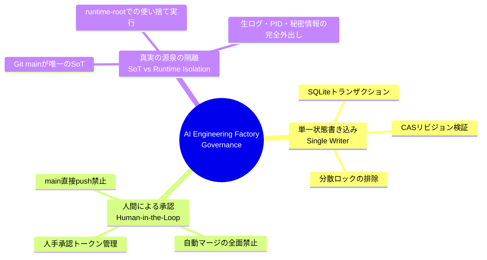

# Architecture Overview

> **AI Engineering Factory: システムビジョンとコンポーネント構成**  
> ※ 本システムの詳細な仕様・厳格な境界・状態遷移の正本はリポジトリ直下の [ARCHITECTURE.md](../../ARCHITECTURE.md) です。本ドキュメントはコンポーネント概要のサマリーです。

---

AI Engineering Factory は、「AI エージェントを専門労働力として組織化し、厳格なソフトウェア工学的コントロールの下で自律開発を行わせる」ためのファクトリー型プラットフォームです。エージェントが任意にコードを main に反映することはできず、必ず独立した隔離環境、自動検証パイプライン、真正証跡生成、そして人間の承認を経て安全に統合されます。

コンポーネント構成図とレイヤー別のサブシステム対応表は [ARCHITECTURE.md §1](../../ARCHITECTURE.md#1-システムアーキテクチャ全体像) を参照してください。ここでは正本にはない、ガバナンスの狙いを一枚で示すマインドマップだけを掲載します。

---

## ガバナンスとセキュリティの 3 本柱

---

## 関連ドキュメント
- [システム全体仕様 (ARCHITECTURE.md)](../../ARCHITECTURE.md)
- [脅威モデルとセキュリティ規約 (SECURITY.md)](../../SECURITY.md)
- [ワーカーエージェント契約 (AGENTS.md)](../../AGENTS.md)
- [運用・トラブルシューティング手順 (OPERATIONS.md)](../../OPERATIONS.md)

