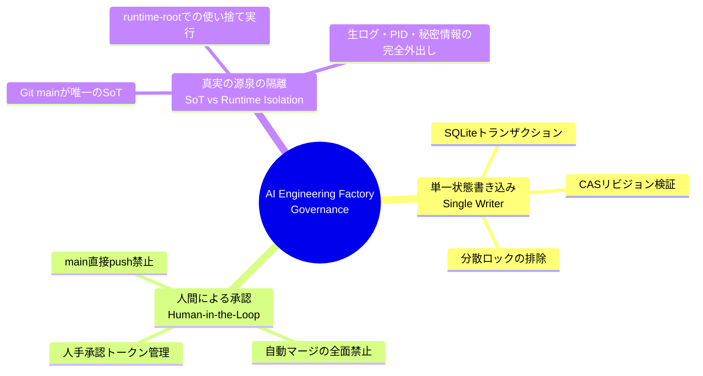

# Architecture Overview

> **AI Engineering Factory: システムビジョンとコンポーネント構成**

---

## 1. システム全体図

AI Engineering Factory は、「AI エージェントを専門労働力として組織化し、厳格なソフトウェア工学的コントロールの下で自律開発を行わせる」ためのファクトリー型プラットフォームです。

エージェントが任意にコードを main に反映することはできず、必ず独立した隔離環境、自動検証パイプライン、真正証跡生成、そして人間の承認を経て安全に統合されます。

---

## 2. アーキテクチャ階層とサブシステム対応

| レイヤー | サブシステム / パス | 役割と責務 |
| :--- | :--- | :--- |
| **① 入力・信頼できる情報源** | `main`, `factory/state`, `tasks/`, `schemas/` | 要件仕様、タスク計画、JSON Schema (2020-12) 仕様定義、長期的な監査投影。 |
| **② 制御プレーン** | `orchestrator/` | タスク取込、依存関係 DAG スケジューリング、ポリシー検証、SQLite+CAS 単一状態台帳、運用 CLI。 |
| **③ ワーカーレイヤー** | `.agents/`, Agent Sessions | Builder（実装担当）、Tester（テスト担当）、Reviewer（監査・レビュー担当）の役割分担。 |
| **④ 実行・隔離境界** | `runtime-root/` | タスクごとの使い捨て Worktree、PID/ポート/一時DBの完全隔離、パス走査抑止。 |
| **⑤ 品質・セキュリティゲート** | `scripts/`, `.github/workflows/` | `ruff`, `pytest`, `secret_scan.py`, `audit_dependencies.py`, CI による fail-closed 検査。 |
| **⑥ 出力・人手承認** | GitHub PR, CLI (`approve`) | 人間レビュアーへの PR 提示、真正証跡（SHA-256 エビデンス）照合、main マージ判断。 |

---

## 3. ガバナンスとセキュリティの 3 本柱

---

## 4. 関連ドキュメント
- [システム全体仕様 (ARCHITECTURE.md)](../../ARCHITECTURE.md)
- [脅威モデルとセキュリティ規約 (SECURITY.md)](../../SECURITY.md)
- [ワーカーエージェント契約 (AGENTS.md)](../../AGENTS.md)
- [運用・トラブルシューティング手順 (OPERATIONS.md)](../../OPERATIONS.md)

